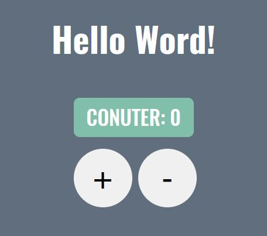

  <h1 align="center">
    ReactCounter
  </h1>
  <h3 align="center">
      
    <br>
  </h3>

## The Project

ReactCounter is a simple counter program that increases and decreases the number based on the user's selection.
<br>


## Built With

* ```REACT```
